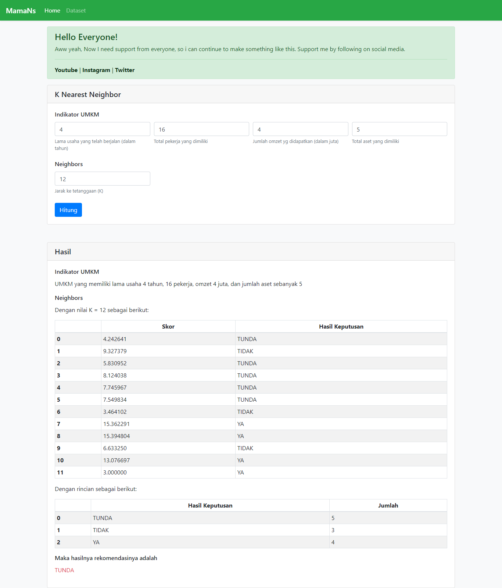

# knn
K Nearest Neighbor (KNN) from scratch untuk pendukung keputusan penerima modal UMKM  
K Nearest Neighbor (KNN) for supporters of capital recipients

<h4>Install requirements</h4>
$ pip install -r requirements.txt

<h4>Screenshot</h4>

